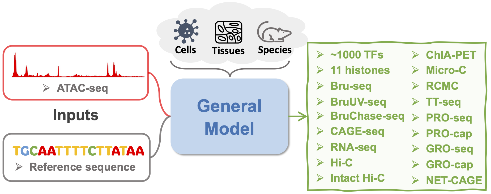

Get Started
-------------------------
-------------------------
Epcotv2 is a general-purpose foundation model for integrative genomic prediction,
capable of inferring diverse regulatory modalities from minimal input data. Unlike task-specific
models, this architecture unifies transcriptional and chromatin-level outputs within a shared
multi-task framework.

Model Inputs
------------

The model takes the following as input:

- **DNA sequence**: One-hot encoded sequence centered on each genomic region of interest
- **ATAC-seq signal**: Chromatin accessibility profiles for the same regions

Both inputs are designed to be cell-type specific and jointly encode local cis-regulatory information.

Predicted Modalities
--------------------

Given the above inputs, the model is trained to simultaneously predict multiple genomic modalities:

- **Nascent RNA transcription** measured by assays such as PRO-seq, GRO-seq, and TT-seq
- **Enhancer-associated transcription** and bidirectional transcription initiation
- **High-resolution chromatin contact maps**, including Micro-C and Hi-C style predictions
- **Regulatory activity of non-coding elements**, including eQTL regions and predicted enhancers
- **Functional impact of non-coding variants** based on localized regulatory context

These outputs are aligned to the same input resolution, enabling unified evaluation and visualization.

Cross-Context Generalization
----------------------------

The model is trained across a large number of human cell types and tissues. It generalizes well
to unseen biological contexts, and supports cross-species transfer.

This model can be used for:

- Predicting transcriptional output from accessible chromatin regions
- Characterizing regulatory elements in new tissues with only ATAC-seq and sequence
- Interpreting the potential functional role of non-coding genetic variants
- Reconstructing 3D chromatin architecture in data-limited settings

Installation
-------------------------

To set up the model locally for inference or fine-tuning, follow the steps below:

.. code-block:: bash

    git clone https://github.com/liu-bioinfo-lab/general_AI_model.git
    cd general_AI_model
    # setup environment
    conda create -n epcot python==3.9
    conda activate epcot
    pip install -r requirements.txt

One can refer to ``epcotv2_basic_tutorial.ipynb`` for the basic usage of this model.
